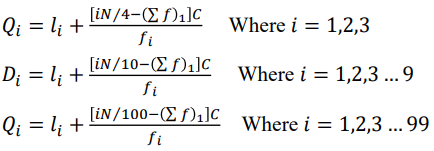
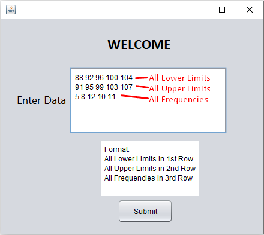
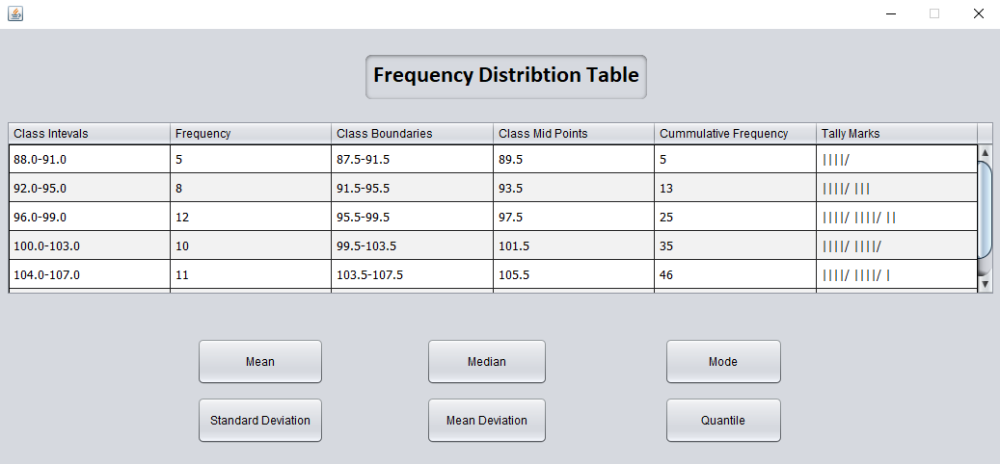
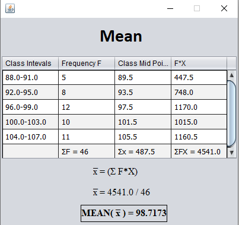
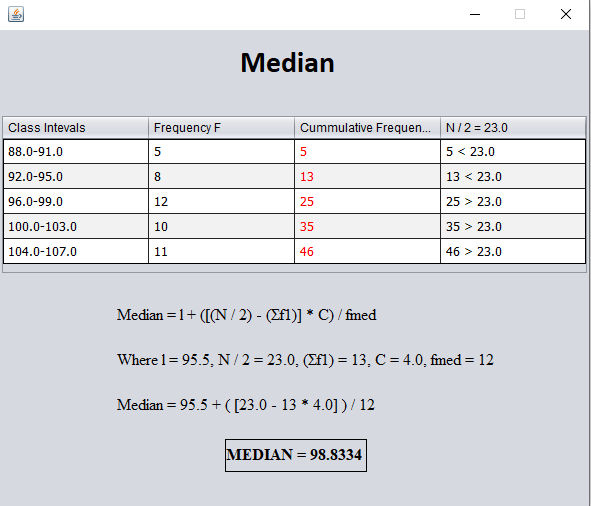
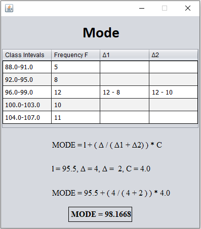
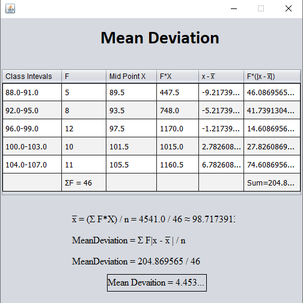
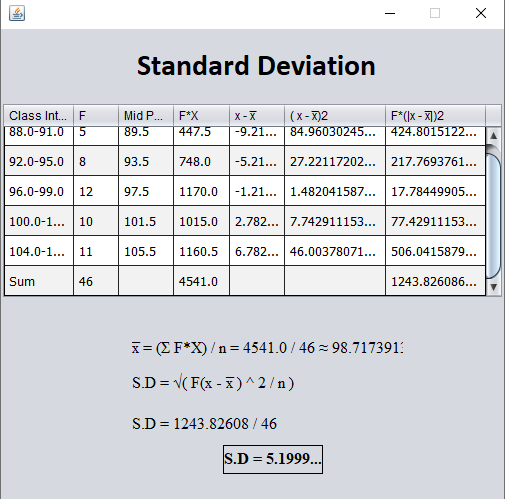
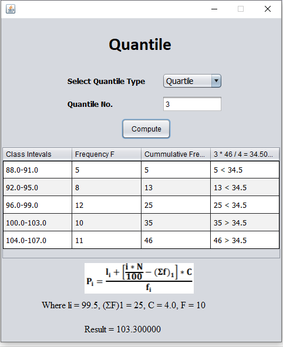

# Frequency-Distribution-Table-in-Java

## Table of Contents
* <a href = "#Overview_Head" > Overview </a> 

* <a href = "#Installation" > How to Execute the Project </a> 

* <a href = "#Int" > Introduction </a> 

  * <a href = "#FDT" > Frequency Distribution Table  </a>
    * <a href = "#FDT_CL" > Class Limits </a> 
    * <a href = "#FDT_CB" >  Class Boundaries </a>
    * <a href = "#FDT_MP" > Class Mid Point </a>
          
  * <a href = "#MCT" > Measure of Central Tendency </a>
    * <a href = "#MCT_AVG" > The Avergae </a> 
      * <a href = "#MCT_AVG_Mean" >  Arithmetic Mean </a>
      * <a href = "#MCT_AVG_Median" > Median </a>
      * <a href = "#MCT_AVG_Mode" > Mode </a>
  
  * <a href = "#MCD" > Measure of Central Dispersion </a>
    * <a href = "#MCD_MD" > Mean Deviation </a> 
    * <a href = "#MCD_SD" > Standard Deviation </a> 
    
  * <a href = "#QT" > Quantiles </a>  
   
* <a href = "#PS" > Program Screenshots </a>  
         
## 
 Overview 
  
It takes the GROUP DATA as input that is all LOWER and UPPER LIMITS and FREQUENCIES of the classes. Computes the MEAN, MEDIAN, MODE, STANDARD DEVIATION, MEAN DEVIATION and QUANTILES.

## 
 How to Execute the Project 

#### 
 Method # 1: Download 'Executable (exe)' file from 'Portable Application Folder' (Easy & Portable) 

                No need to install anything but it is for WINDOWS OS  
                
#### 
 Method # 2: Download and Load Project in Eclipse IDE to Run it 

                Eclipse IDE & JVM will be required.

## 
 Introduction 

### 
Frequency Distribution Table 

The organization of set of data in a table showing the breakup of data into classes or groups together with the number of observations in each class or group is called a “Frequency Distribution”. The data presented in frequency distribution table is known as “grouped data”, while the data in original form is known as “Ungrouped data”.
The data organized or summarized in the frequency distribution generally destroys much of the original detail of the data, but the important advantage is that more information are obtained in systematical order and an overall picture is obtained. In terms of its instruction, each class or group of measurements has lower and upper limits, lower and upper boundaries, an interval and a middle value.

#### 
i) Class Limits

 
The group in which we divide the data are called “Class Intervals”. Each class interval consists of two class limits known as lower and upper class limits. Lower class limit is that limit at which interval starts and upper class limit is that limit at which interval ends. A class interval, which has either, no upper class limit or no lower class limit, is known as “Open Class Interval.

#### 
ii) Class Boundaries

The class boundaries are the precise points, which separate various classes rather than values being included in one of the classes. A class boundary is mid way between upper limit of a class and the lower limit of next higher class. In practice class boundaries are obtained by adding the upper class limit to the lower class limit of next class divided by 2. Class boundaries are also used to find the size of class interval. It is the difference of upper and lower class boundaries of the same class interval.

#### 
iii) Mid Point

Mid Point of class is that point which divides the class into two equal parts. In practice, it is obtained by dividing either the sum of the lower and upper limits or boundaries of the class interval by 2.

### 
Measure of Central Tendency

Any measure indicating the center of a set of data arranged in an ascending (increasing) or descending (decreasing) order of magnitude is called a measure of a central tendency (location). An average, therefore, is a value which represents the data. In many cases only average do not give complete information about the collected data. We also must see how this data is deviated from its central value (mean). Thus, the study of measures of dispersion is very much important for the purpose of analyzing the data.

#### 
 The Average

An average is a single value which is intended to represent a set of data or a distribution as a whole. Types of Averages: 
There are various types of averages. The most used measures of central tendency are
i.	The Arithmetic Mean 
ii.	The Median 
iii.	The Mode

##### 
 i) Arithmetic Mean

It is most familiar average. It is defined as a value obtained by dividing the sum of all the observations by their number and is denoted by , that is,
For the grouped data, the arithmetic mean is calculated by using the formula,

 

 

 
 

  <figcaption align = "center"> Mean formula for Grouped Data </figcaption>
 

 
##### 
 ii) Median 

The Median of a set of observations, arranged in ascending or descending order of magnitude, is the middle value of the data when the number of observations is odd or the arithmetic mean of the two middle values when the number of observation is even.
For the grouped data, the median is computed by using the following formula,
 

 

 
 

  <figcaption align = "center"> Median Formula for Grouped Data  </figcaption>
 

  

##### 
 iii)  Mode 

It is the number (s) that occur with the greatest frequency. The mode may not exist and even if it exist, it may not be unique
Computation of Mode from Grouped Data For the grouped data, the mode is computed by using the following formula,
 

 

 
 

  <figcaption align = "center"> Mode Formula for Grouped Data  </figcaption>
 
 

### 
 Measure of Central Tendency 

#### 
 i)  Mean Deviation 

It is the arithmetic mean of absolute values of all observations from their mean. All deviations are taken positive because it is the property of arithmetic mean that the algebraic sum of the deviation from their mean is zero. Suppose the observations 𝑥1, 𝑥2, … , 𝑥𝑛 have a mean 𝑥ҧ, the mean deviation is defined as,

 

 
 

  <figcaption align = "center"> Mean Deviation Formula for Grouped Data  </figcaption>
 
 

#### 
 ii)  Standard Deviation 

In the calculation of mean deviation, deviations are taken as positive makes it rather artificial to the logical mind. Therefore, the most precise and the most satisfactory measure of dispersion, the standard deviation, is always calculated from mean and is represented by Greek letter 𝜎 (Sigma). In the calculation of standard deviation, the sign disappears as the numbers are squared.
For the grouped data, the standard deviation is calculated as,

 

 
 

  <figcaption align = "center"> Mean Deviation Formula for Grouped Data  </figcaption>
 
 

### 
 Quantiles 

The principle according to which the distribution is divided into two equal parts, may be extended to any number of divisions. The values which divide the distribution into four equal parts, are called Qualtiles. These values are denoted by 𝑄1,𝑄2 𝑎𝑛𝑑𝑄3 respectively. Similarly the values which divide the distribution into ten equal parts, are called deciles and are denoted by 𝐷1,𝐷2 … 𝐷9 ; while the values dividing the data into one hundred equal parts, are called Percentiles and are denoted by 𝑃1, 𝑃2 … 𝑃99
**QUARTILES, DESCILES, PERCENTILES** and other values obtained by equal sub divisions of the distribution are **collectively called Quantiles**. The calculation of quantiles is analogous to the calculation of median. These are given as:

 

 
 

  <figcaption align = "center"> Different Quantiles Formula for Grouped Data  </figcaption>
 

## 
 Program Screenshots 

 

 
 

  <figcaption align = "center"> Fig-A: User input </figcaption>
 

  
 
 

 

 
 

  <figcaption align = "center"> Fig-B: Frequency Distribution Table of Input Data </figcaption>
 

  
 
 

 

 
 

  <figcaption align = "center"> Fig-C: Mean of Data  </figcaption>
 

  
 
 

 

 
 

  <figcaption align = "center"> Fig-D: Median of Data  </figcaption>
 

  
 
  

  
  

 
 

  <figcaption align = "center"> Fig-E: Mode of Data  </figcaption>
 

  
 
  

  
  

 
 

  <figcaption align = "center"> Fig-F: Mean Deviation of Data  </figcaption>
 

  
 
  

  
  

 
 

  <figcaption align = "center"> Fig-G: Standard Deviation of Data  </figcaption>
 

  
 
  

  
  

 
 

  <figcaption align = "center"> Fig-H: Quantiles of Data  </figcaption>
 

  
